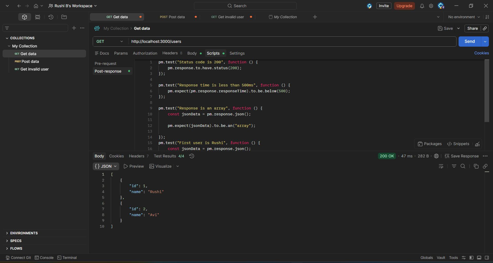
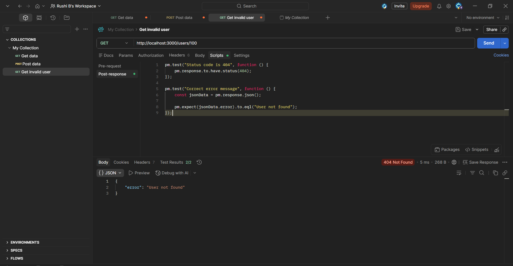
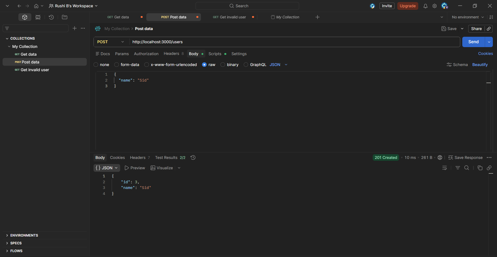
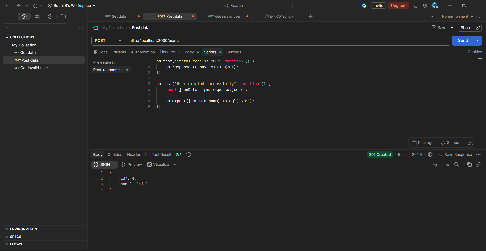

# API Testing Practice

Simple API testing project using Express.js and Postman.

## Features
- GET /users
- GET /users/:id
- POST /users
- Automated Postman tests
- Negative testing

## Tech Stack
- Node.js
- Express.js
- Postman

## Screenshots

### GET API Tests

### Negative Testing

### POST API Success

### POST API Tests
