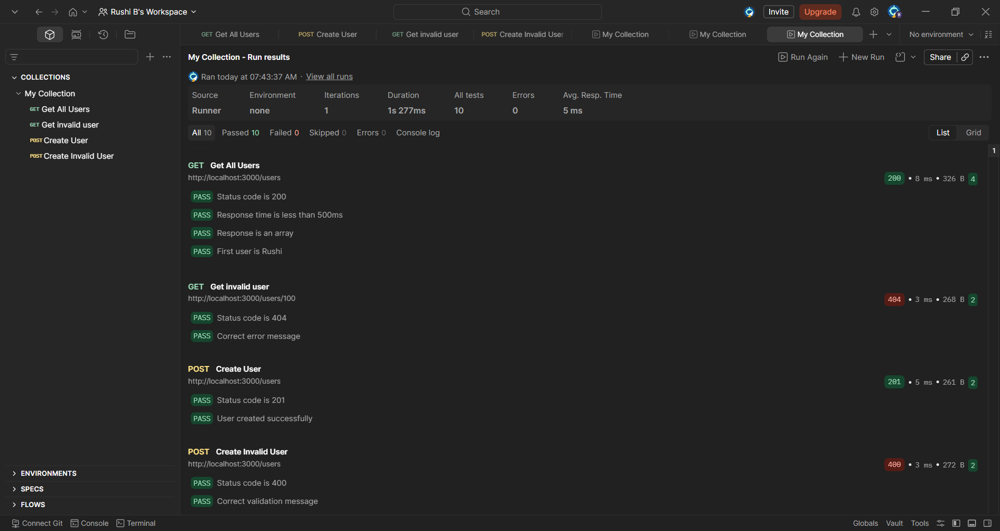
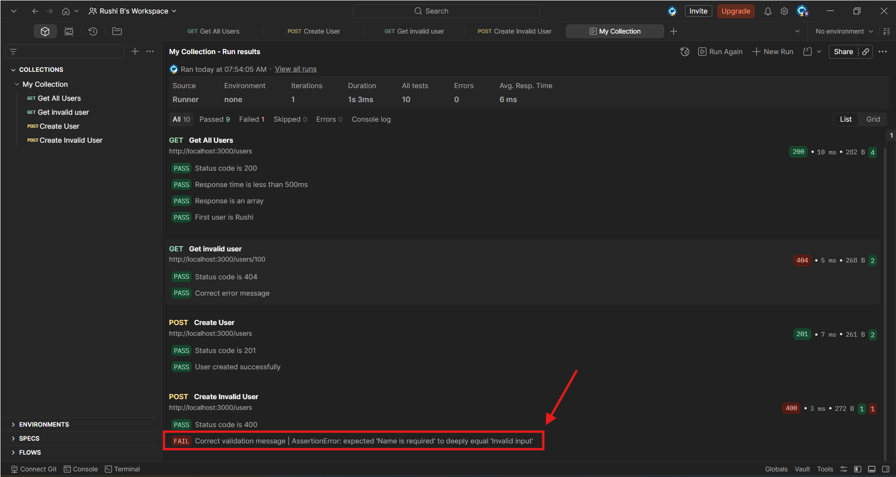
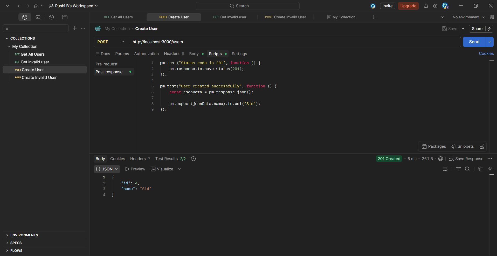

# API Testing Practice

Simple API testing project using Express.js and Postman.

## Features
- **GET /users**: Retrieve all users.
- **GET /users/:id**: Error handling for invalid user IDs.
- **POST /users**: Create new users with validation.
- **Automated Regression Suite**: 10+ automated assertions.
- **Negative Testing**: Validation for missing fields and 400/404 error codes.

## Tech Stack
- Node.js
- Express.js
- Postman (Collection Runner)

## Screenshots

### 1. Automated Regression Suite (10/10 Passed)
This screenshot shows the Postman Collection Runner executing all tests successfully, proving the API's reliability.

### 2. Intentional Failure & Defect Detection
Demonstrating how the automated suite catches discrepancies when the expected response does not match the actual server output.

### 3. POST Request Setup & Validation
A deep dive into the POST method, showing the JSON body and the scripts used to validate a 201 Created status.

### GET API Tests !
[GET Tests](Screenshot/get-users-tests.png)

 ### Negative Testing !
 [404 Test](Screenshot/negative-test-404.png) 
 
 ### POST API Success !
 [POST Success](Screenshot/post-user-success.png) 
 
 ### POST API Tests !
 [POST Tests](Screenshot/post-user-tests.png)